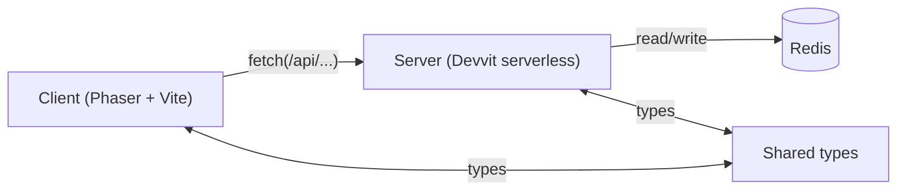
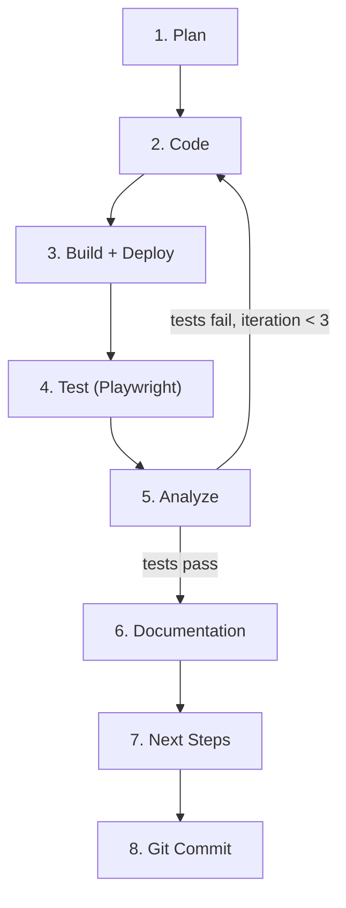

# Agent Gamebox

A monorepo of multiplayer and single-player games built as [Devvit](https://developers.reddit.com/docs/) apps, designed to run natively inside Reddit posts. Each game is a self-contained Devvit app with a Phaser-powered webview client and a serverless Node backend.

## Games

| Game | Description |
| ---- | ----------- |
| [Blokus](games/phaser/blokus/) | Tile-placement strategy game |
| [Diplomacy](games/phaser/diplomacy/) | Classic 7-power negotiation board game |
| [Jeopardy](games/phaser/jeopardy/) | Quiz show with real J-Archive questions |
| [Mini Golf](games/phaser/mini-golf/) | Physics-based mini golf |
| [Rush Hour](games/phaser/rush-hour/) | Sliding puzzle game |
| [Scattergories](games/phaser/scattergories/) | Word-based party game |
| [Worms](games/phaser/worms/) | Artillery strategy with destructible terrain |

## Architecture

Every game follows the same three-layer structure:

```
games/phaser/{game}/
├── src/
│   ├── client/     Phaser webview (Vite build)
│   ├── server/     Devvit serverless backend (Node)
│   └── shared/     Shared types between client and server
├── devvit.json     App manifest and permissions
├── package.json
└── tsconfig.json
```



- **Client** -- Full-screen webview rendered with Phaser. Communicates with the server via `fetch(/api/...)`.
- **Server** -- Serverless Node backend with access to Redis for persistence. Runs in a restricted environment (no `fs`, `net`, `http` modules).
- **Shared** -- TypeScript types and constants used by both client and server.

## Getting Started

### Prerequisites

- Node.js and npm
- [Devvit CLI](https://developers.reddit.com/docs/)

### Development

All commands run from within a game directory:

```bash
cd games/phaser/{game}
npm install
```

| Command | Description |
| ------- | ----------- |
| `npm run dev` | Run client, server, and devvit in parallel |
| `npm run build` | Build client and server |
| `npm run type-check` | Run `tsc --build` |
| `npm run lint` | ESLint |
| `npm run lint:fix` | ESLint with auto-fix |
| `npm run check` | Type-check + lint:fix + prettier |
| `npm run deploy` | Build and `devvit upload` |

### Playtest

Deploy to a playtest subreddit:

```bash
cd games/phaser/{game}
npx devvit playtest
```

The playtest URL follows the pattern:

```
https://www.reddit.com/r/{subreddit}?playtest={app-name}
```

where `{subreddit}` comes from the game's `.env` and `{app-name}` from its `devvit.json`.

### Bulk Upload

Build and upload every game in one pass:

```bash
bash tools/upload-all.sh
```

## Tooling

| Path | Purpose |
| ---- | ------- |
| `tools/tsconfig-base.json` | Shared TypeScript base config (ES2023, strict, composite) |
| `tools/upload-all.sh` | Builds and uploads all games sequentially |
| `.editorconfig` | 2-space indent, LF line endings, UTF-8 |
| `.env.template` | Template for per-game `.env` files |

## Testing

Automated browser testing uses two Playwright MCP servers (`player_one`, `player_two`), each with its own persistent browser profile. This enables multiplayer testing where two agents operate separate browsers simultaneously.

- Browser profiles: `.devvit-testing/profiles/p1/` and `.devvit-testing/profiles/p2/`
- Screenshots: `.devvit-testing/screenshots/p1/` and `.devvit-testing/screenshots/p2/`
- Each game's `.env` specifies `PLAYWRIGHT_PLAYER` to assign an agent to a player instance

## Agent Workflow: Full Cycle

Development is driven by an autonomous agent workflow (`devvit-full-cycle`) that takes a game path and a feature request, then runs the entire build-test-ship loop without manual intervention.

```
/devvit-full-cycle phaser/jeopardy Add score tracking to the game
```



### Phases

1. **Plan** -- Analyze the game's codebase, generate a development plan, and save it to `.workflows/{game}/{wf-id}/plan.md`.
2. **Code** -- Implement the plan. Run type-check and lint; fix any errors before moving on.
3. **Build + Deploy** -- `npm run build`, then `npx devvit playtest` to push to the playtest subreddit. The playtest URL is constructed automatically from `devvit.json` and `.env`.
4. **Test** -- Use Playwright MCP to navigate to the playtest URL, interact with the game inside Reddit's iframe, take screenshots, and check the console for errors.
5. **Analyze** -- Evaluate test results against the plan's criteria. If critical tests fail and fewer than 3 iterations have run, generate a fix plan and loop back to Code. Otherwise, proceed.
6. **Documentation** -- Update `docs/architecture.md`, `docs/game-mechanics.md`, `docs/api-reference.md`, `docs/scenes.md`, and `docs/changelog.md` inside the game directory.
7. **Next Steps** -- Review the current state of the game and produce a prioritized list of recommendations (bugs, mechanics, UI/UX, performance, new features).
8. **Git Commit** -- Stage game files and workflow artifacts, generate a descriptive commit message, and commit.

### Workflow State

Each run creates a directory at `.workflows/{game-path}/{wf-id}/` containing:

| File | Purpose |
| ---- | ------- |
| `request.txt` | Original feature request |
| `plan.md` | Development plan |
| `deployment.json` | Playtest URL and deploy info |
| `test-results.json` | Pass/fail for each test scenario |
| `status.json` | Current phase, iteration count, success/failure |
| `fix-plan.md` | Generated on test failure for the retry loop |
| `next-steps.md` | Prioritized recommendations for future work |
